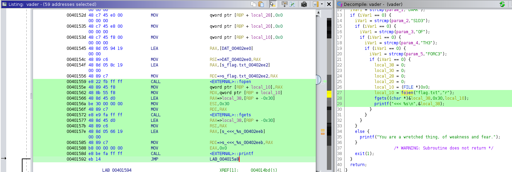

`/sith.txt`というファイルを読むことがゴールである。

`0x405050`に`/sith.txt`という文字列を書き込み、`0x401559`から始まる命令列を実行することで`/sith.txt`の内容を読み出す。

`0x401559`から始まる命令列は以下の画像にあるように、fopen(),fgets(),printf(),を実行するのでこれを使うことで目的を達成できる。

尚、main関数内のfgetsは一度に0x100byteしか入力できないという制限があるが、3回main関数を実行することでこの制限を回避している。